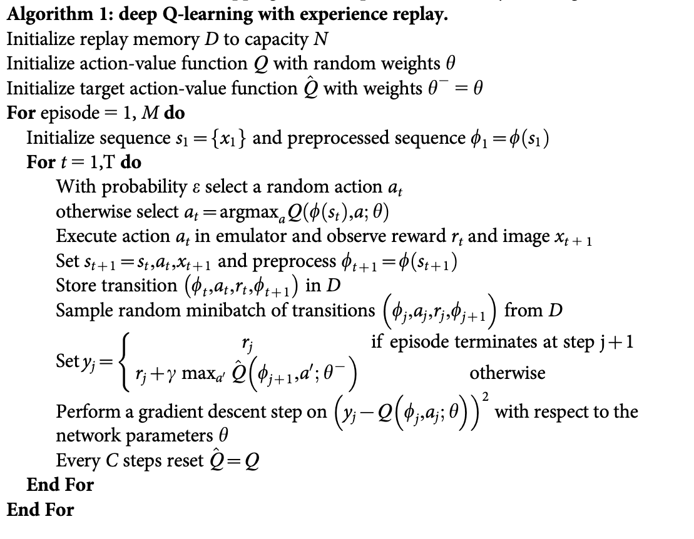

# Deep Q-Neural Network Library 


### Description of the library

In this repository is the implementation of a double deep q-neural network in pytoch that can solve every gym environment with a discrete action space. In this file are the results of two of the most known Open AI gym environments: CartPole-v1, MoonLander-v2.


### How to install the library 

In order for the library to work properly you have to have installed pytorch, numpy and gym:
```bash
!pip install torch
!pip install numpy
!pip install gym
```

### How to use the library

For an agent to learn from an environment, you have to specify some characteristics like the action and observation space, learning rate, discount factor, etc. You have to name to model to save the best version of it and test it later.

By default there are set:
```python
class Agent(object):
    def __init__(self, action_space, observation_space,
    memory_size=5000, #how many states will the agent remember
    lr=0.001, #learning rate 
    eps=1,    #epsilone - the probabilty of choosing a  random action during training
    gamma=0.990,# discount factor
    batch_size=36, #the batch size 
    update_target_cntr=10, #after how many episodes will the taget network update
    name='None'):
```

After importing the agent module and making a new instance of it, the only functions you have to call are the training one(which trains the agent from the memory accumulated), the updating one (which updates the greedy strategy and the target model) + the function which stores into the memory the state of the environment.
Below is an example of how to train the model:

```python
from agent import Agent
import numpy as np
import gym

ENVIROMENT_NAME = 'LunarLander-v2'#'CartPole-v1'
MODEL_NAME = ENVIROMENT_NAME + '-policy'
TRAINING_EPISODES = 500

env = gym.make(ENVIROMENT_NAME)

agent = Agent(env.action_space, env.observation_space, name=MODEL_NAME)
for episode in range(TRAINING_EPISODES):
    state = env.reset()
    score = 0

    while not done:
        action = agent.act(state)
        next_state, reward, done, _ = env.step(action)
        score += reward

        agent.store_transition(state=state, next_state=next_state,action=action,reward=reward,done=done)
        agent.learn()

        state = next_state

    done=False
    scores.append(score)

    agent.update(episode, score)
    avg_score = np.mean(scores[-5:])

    if episode % 25 == 0:
        print('Episode {} and average score:{}(eps: {}), with the best score of:{}'.format(episode, avg_score, agent.eps, agent.best_score))

```
To evaluate the model you just have to put the model into the evaluation mode by assigning it the path where is it saved, like so:

```python
agent.eval(MODEL_NAME)

for episode in range(EVAL_EPISODES):
    state = env.reset()
    score = 0

    while not done:
        env.render()

        action = agent.act(state)
        next_state, reward, done, _ = env.step(action)
        state = next_state
        score += reward

    print("Finnished episode in: {}".format(score))
    score = 0
    done = False
```

### How the library works
The library follows the algorithm in the DeepMind's paper: [Human-level control through deep reinforcement learning](https://web.stanford.edu/class/psych209/Readings/MnihEtAlHassibis15NatureControlDeepRL.pdf)

